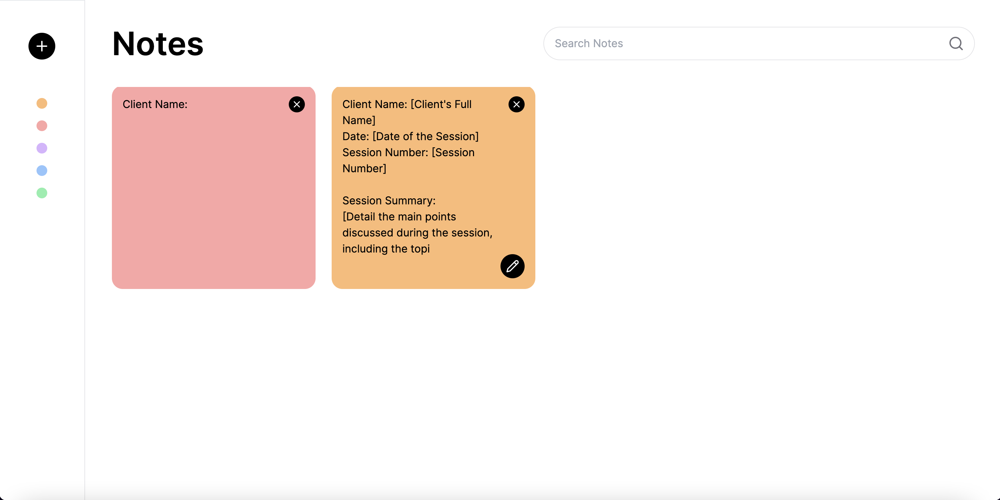

# Notes App

### An app that will allow a user to create, update, delete, and search notes.



## Getting Started

### Requirements:

#### npm

```bash
sudo npm i -g expo-cli
```

### Installing Locally

After cloning the repo, run the following commands:

```bash
cd notes-app
```

```bash
npm i
```

### Running Locally

To run locally, run the following command:

```bash
npm run dev
```

### Notes

This project includes initial setup for API routes for notes in `src/pages/api/notes`
